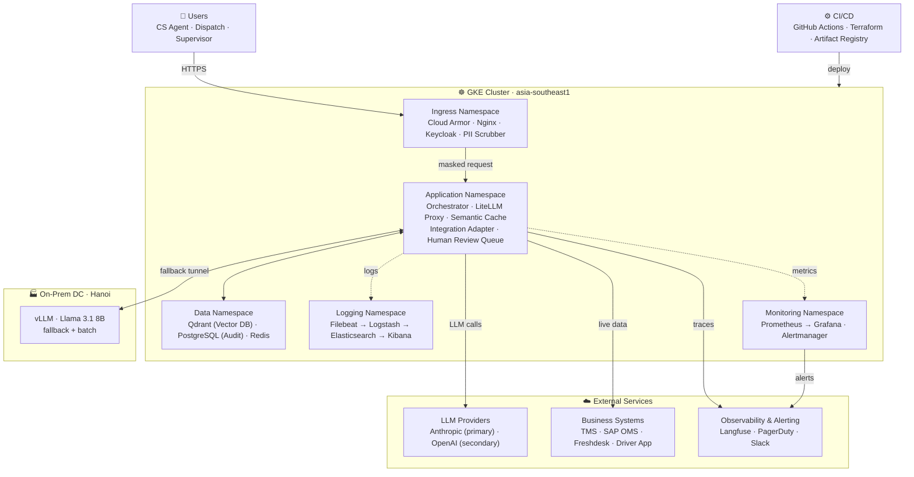
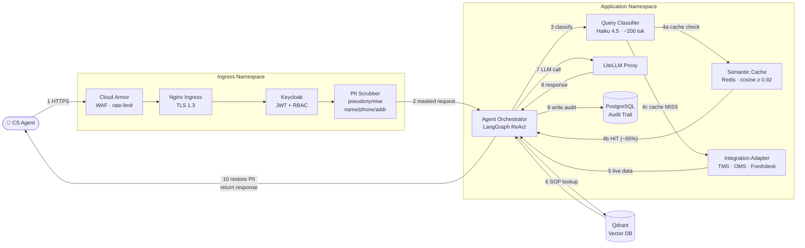
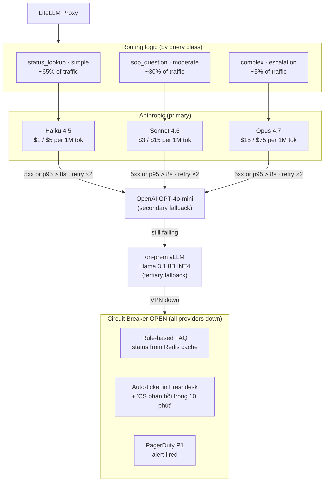

# Project Documentation — Logistics Operations Agent
## Nhóm 4 · Zone E402 · AICB-P1 Phase 1 · 2026-04-22

---

## Table of Contents

1. [Project Overview](#1-project-overview)
2. [Team Profile](#2-team-profile)
3. [Scenario Selection & Rationale](#3-scenario-selection--rationale)
4. [Enterprise Context & Constraints](#4-enterprise-context--constraints)
5. [Deployment Architecture](#5-deployment-architecture)
6. [System Components](#6-system-components) — catalogue · namespaces · security checklist
7. [Request Lifecycle](#7-request-lifecycle)
8. [Cost Analysis](#8-cost-analysis)
9. [Cost Optimization Strategies](#9-cost-optimization-strategies)
10. [Reliability & Scaling Plan](#10-reliability--scaling-plan)
11. [Evaluation Framework](#11-evaluation-framework)
12. [Phase 2 Track Decision](#12-phase-2-track-decision)
13. [Decision Log — Key Choices & Rejected Alternatives](#13-decision-log)

---

## 1. Project Overview

**Agent name:** Logistics Operations Agent

**One-line description:** An AI copilot for the CS and dispatch team of a Vietnamese mid-size 3PL company, handling order status lookups, customer ticket drafting, and SOP Q&A in real time.

**Business context:**
- Company: mid-size 3PL (~500 staff, ~50,000 shipments/day)
- Agent users: 85 (CS agents ×40, dispatch coordinators ×30, ops supervisors ×15)
- Daily volume: ~800 requests/day MVP, ~4,000 req/day Growth
- Peak hours: 08–10h and 16–19h — load 4× normal average
- Consequences of failure: wrong status → customer complaint; slow CS reply → SLA miss + penalty

**Why this matters (the "production, not demo" principle):**
Every design decision in this project is anchored to the fact that AI errors in logistics have direct financial consequences. This is not a chatbot for convenience — it is a critical-path tool used by 85 people whose daily KPIs depend on it. Architectural choices (PII scrubbing, semantic caching, fallback chain, eval gates) all derive from this constraint.

---

## 2. Team Profile

| Member | GitHub | Pillar strengths | Phase 2 focus |
|---|---|---|---|
| Hoàng Đinh Duy Anh | `dduyanhhoang` | CP3 AI 4 · CP1 Business 3 | Agent orchestration + eval pipeline |
| Nguyễn Tiến Huy Hoàng | `kawaii-bunny` | CP3 AI 4 · CP2 Infra 4 | Production eval + fine-tuning pipeline |
| Trần Nhật Vĩ | `trannhatvi-ai` | CP3 AI 4 · CP1 Business 4 | GraphRAG design + business mapping |
| Trần Thanh Phong | `thnhphng04` | CP3 AI 3 · evenly distributed | Fine-tuning data curation |

**Team CP averages:** CP1 Business 3.25 · CP2 Infra 3.25 · CP3 AI Engineering **3.75** (highest)

**Team strengths coming in:**
1. Requirement analysis and planning
2. RAG pipeline design
3. Tool calling and agent orchestration

---

## 3. Scenario Selection & Rationale

**Chosen:** Scenario 5 — Logistics Operations Agent

**Why Scenario 5 over others:**
The logistics scenario provides maximum tension across the four highest-weighted rubric areas:

| Rubric area | Weight | How Scenario 5 stresses it |
|---|---|---|
| Architecture | 20 pts | PII, multi-system integration, and fallback all require non-trivial design |
| Cost analysis | 20 pts | Status-lookup caching, on-prem capex, and super-linear ELK growth all create interesting cost dynamics |
| Reliability/scaling | 15 pts | Peak-hour 4× traffic and SLA commitments force explicit scaling design |
| Cost optimization | 15 pts | Semantic cache + model routing already in design; 3 further strategies are natural |

**The core tension that drives all decisions:**
Queries split cleanly into (a) cheap, repetitive status lookups and (b) rare, complex reasoning. PII is in every order. Peak traffic hits 3–5× during rush hours. This exact tension justifies: semantic caching (eliminates cost for class A), model routing Haiku→Sonnet→Opus (right-sizes cost for class B), edge PII scrubbing (compliance without losing model quality), and on-prem vLLM fallback (reliability without full on-prem commitment).

---

## 4. Enterprise Context & Constraints

### 4.1 Organisation profile

| Item | Detail |
|---|---|
| Company type | Mid-size 3PL (~500 staff, ~50,000 shipments/day) |
| Existing systems | TMS (proprietary), SAP OMS, Freshdesk, driver mobile app, Gmail, SAP B1 ERP |
| Languages | Vietnamese + English (mixed in CS tickets) |
| Deployment region | Singapore (asia-southeast1) — ASEAN data residency |

### 4.2 Data sensitivity map

| Data class | Sensitivity | Cross-border? | Notes |
|---|---|---|---|
| Recipient PII (name, phone, address) | High | No — VN only | PDPA personal data; pseudonymised before cloud call |
| Order status & tracking | Medium | Yes, with masking | Commercial ops data |
| CS ticket content | Medium | No in raw form | May contain PII fragments |
| SOPs / runbooks | Low | Yes | Internal docs only |
| Billing / pricing | Medium | No | Commercial sensitivity |
| Aggregate analytics | Low | Yes | Anonymised stats |

### 4.3 Top-5 enterprise constraints

**Constraint 1 — PDPA compliance**
Recipient name, phone, and address must never reach an external LLM API in raw form. Vietnamese PDPA (Nghị định 13/2023/NĐ-CP) Article 26 requires data minimisation. Architecture response: custom PII Scrubber service at the edge — regex + NER to pseudonymise before any cloud egress. Mapping stored in-VN only (PostgreSQL).

**Constraint 2 — Multi-system live integration**
Real-time read access required across TMS (order/tracking), Freshdesk (ticket state), and SAP OMS (stock/routing). No single unified API exists. Architecture response: Integration Adapter microservice with REST wrappers per system, exposed as LangGraph tools.

**Constraint 3 — Peak-hour SLA**
Rush hours 08–10h and 16–19h drive 4× normal traffic. Contractual p95 ≤ 5s. Architecture response: HPA 3→10 pods, Kubernetes CronJob pre-scale at 07:45 and 15:45, Redis queue absorb burst, load shedding policy for queue depth > 500.

**Constraint 4 — Audit trail**
Every AI-generated customer-facing response must be logged with: prompt hash, model version, agent version, human-approval flag, outcome. Required for PDPA accountability and dispute resolution. Architecture response: PostgreSQL 16 append-only audit table (role with INSERT only, no UPDATE/DELETE).

**Constraint 5 — Graceful degradation**
If primary LLM provider is unavailable, the system must not return errors to CS staff. Architecture response: 4-level fallback chain (Claude → GPT-4o-mini → on-prem vLLM → rule-based + auto-ticket).

---

## 5. Deployment Architecture

### 5.1 Deployment model decision

| Option | PII control | Time to deploy | Cost model | VN regulatory fit | Score |
|---|---|---|---|---|---|
| Cloud API only | Low | Days | Per-token | Poor (PII risk) | ★★ |
| On-premise only | Highest | 3–6 months | Capex + GPU | Good but slow | ★★ |
| **Hybrid (chosen)** | **Tunable** | **3–4 weeks** | **Mixed** | **Best** | **★★★★★** |

**Chosen: Hybrid**

**Reason 1 — PII control without sacrificing model quality.**
PII Scrubber service runs inside the VN-hosted GKE cluster. Pseudonymisation happens before any request reaches Claude API. The model still receives full context for reasoning — just with masked identifiers. PDPA satisfied, frontier model quality preserved.

**Reason 2 — Cost and reliability isolation by query class.**
~65% of queries are repetitive status lookups that hit Redis semantic cache (zero LLM cost). Only genuinely novel queries hit the cloud LLM. On-prem vLLM at Hanoi DC serves as tertiary fallback when both cloud providers are down. This architecture keeps the system operational during cloud outages while keeping capex at the minimum viable level (1× A100 for fallback only).

### 5.2 Platform: GKE Autopilot, asia-southeast1 (Singapore)

**Why GKE Autopilot:**
- Singapore region satisfies VN data residency for B2B SaaS (ASEAN data stays in-region, PII-masking applied before egress)
- Autopilot removes node management overhead — right-sized for a 500-staff 3PL with no dedicated DevOps team
- Google Cloud VPC Service Controls allow hard perimeter around PII-adjacent workloads
- Native integration with Artifact Registry, Cloud Armor, Cloud CDN, Secret Manager

### 5.3 Architecture diagrams

#### Diagram 1 — General design overview



#### Diagram 2 — Request lifecycle (happy path)



#### Diagram 3 — LLM routing & fallback chain



---

## 6. System Components

### 6.1 Full component catalogue

| Layer | Component | Tool | Role |
|---|---|---|---|
| WAF / DDoS | Cloud Armor | Google Cloud | Block malicious traffic, OWASP top-10 ruleset, rate-limit by IP |
| Ingress | Nginx Ingress Controller | Kubernetes | TLS 1.3 termination, path-based routing |
| Auth | Keycloak | Open-source on GKE | JWT issuance; RBAC roles: CS (read-only), dispatch (approve tickets), supervisor (override model) |
| PII scrubber | Custom FastAPI | In-VN (GKE) | Regex + NER to pseudonymise name/phone/address; mapping stored in PostgreSQL |
| Agent orchestrator | FastAPI + LangGraph | GKE Deployment ×3 | ReAct loop, tool calling, confidence scoring, audit log writer; HPA 3→10 replicas |
| LLM proxy | LiteLLM | GKE Deployment | Unified OpenAI-compatible API, routing policy, retry with jitter, circuit-breaker, provider failover |
| Query classifier | Haiku 4.5 via LiteLLM | (inline) | Intent label in ≤200 input tokens; classifies into 5 request classes |
| Semantic cache | Redis 7 (3-node) | GKE StatefulSet | LLM response cache by embedding similarity (cosine ≥ 0.92), TTL 60s (status) / 5min (SOP) |
| RAG / Vector DB | Qdrant | GKE StatefulSet | SOP/runbook embeddings; text-embedding-3-small (OpenAI); top-k=5 chunks injected into prompt |
| Integration adapter | FastAPI | GKE Deployment | REST wrappers for TMS, SAP OMS, Freshdesk API, driver app webhook; exposed as LangGraph tool calls |
| Human review queue | Redis Streams + Freshdesk | GKE + external | Low-confidence (< 0.7) responses queued for supervisor approval before customer-facing send |
| Relational DB | PostgreSQL 16 | GKE StatefulSet | Append-only audit trail (prompt hash, model, version, latency, human-review flag, outcome); user sessions |
| Fallback LLM | vLLM + Llama 3.1 8B INT4 | On-prem DC (Hanoi) | Tertiary fallback when cloud providers unreachable; overnight batch ticket triage (22–06h) |
| Logging | Filebeat → Logstash → Elasticsearch → Kibana | Logging namespace | Centralised structured logs; 30-day hot index; 90-day warm archive; ILM policy |
| Metrics | Prometheus + Grafana + Alertmanager | Monitoring namespace | SLO dashboards, p95 latency, cost-per-query, cache hit rate, circuit-breaker state |
| Alerting | PagerDuty P1 + Slack #ops-alerts P2 | External SaaS | On-call escalation for critical vs. warning thresholds |
| LLM tracing | Langfuse Cloud | External SaaS | Trace replay, RAGAS eval tracking, cost dashboard (`cache_read_input_tokens`), prompt version management |
| CI/CD | GitHub Actions | External SaaS | Build → push Artifact Registry → Helm rolling deploy to GKE |
| IaC | Terraform | CI runner | GKE cluster, VPC, Cloud Armor, Cloud VPN HA, Secret Manager |
| Secrets | Google Secret Manager | GCP | API keys (Claude, OpenAI, Freshdesk), database passwords; never in code or env vars |
| VPN | Cloud VPN HA | GCP ↔ On-prem | Encrypted HA tunnel to Hanoi DC for vLLM fallback; 2 tunnels, 99.99% SLA |

### 6.2 Kubernetes namespaces

| Namespace | Contents | Purpose |
|---|---|---|
| `ns-ingress` | Cloud Armor, Nginx, Keycloak, PII Scrubber | Edge: auth, rate-limiting, PII masking |
| `ns-application` | Orchestrator, LiteLLM, Integration Adapter, Human Review Queue | Core agent logic |
| `ns-data` | Qdrant, PostgreSQL, Redis | State layer — all persistent storage |
| `ns-logging` | Filebeat DaemonSet, Logstash, Elasticsearch, Kibana | Centralised log pipeline |
| `ns-monitoring` | Prometheus, Grafana, Alertmanager | Metrics and alerting |

### 6.3 Security & compliance checklist

| # | Control | Status | Notes |
|---|---|---|---|
| 1 | PII pseudonymised before any cloud LLM call | ✅ Done | PDPA Nghị định 13/2023/NĐ-CP Article 26 data minimisation; regex + NER in PII Scrubber service |
| 2 | All API keys in Google Secret Manager | ✅ Done | Never in code, env vars, or Docker images; rotated quarterly |
| 3 | VPC private nodes — no public IPs on GKE workload nodes | ✅ Done | Cloud NAT for outbound; ingress via Cloud Load Balancer only |
| 4 | Cloud Armor WAF with OWASP top-10 ruleset | ✅ Done | Rate-limit by IP; geo-restriction to VN + SG if required |
| 5 | Audit trail append-only in PostgreSQL | ✅ Done | DB role with INSERT only — no UPDATE/DELETE granted |
| 6 | Encryption at rest | ✅ Done | GCP default CMEK on GKE persistent volumes + Cloud SQL |
| 7 | Encryption in transit | ✅ Done | TLS 1.3 on all external traffic; mTLS between cluster services (Istio sidecar) |
| 8 | RBAC roles enforced via Keycloak | ✅ Done | CS agents: read-only; dispatch: approve tickets; supervisors: override model responses |
| 9 | Data residency | ✅ Done | GKE in asia-southeast1 (Singapore); on-prem in Hanoi; no data written outside ASEAN |
| 10 | PDPA DPA signed with Google Cloud | ⬜ Pre-launch | Data Processing Agreement required before production go-live |
| 11 | Penetration test on PII Scrubber | ⬜ Pre-launch | Specifically test bypass attempts on pseudonymisation before production launch |
| 12 | Llama 3.1 8B model licence review | ⬜ Pre-launch | Confirm Meta Llama 3.1 Community Licence permits internal B2B SaaS use |

**Critical path items before go-live:** items 10, 11, 12 must be cleared. Items 10 and 11 block production launch; item 12 blocks on-prem vLLM use in any customer-facing fallback path.

---

## 7. Request Lifecycle

**Step-by-step for a cache-miss SOP question (worst-case path):**

1. **CS agent sends query** via browser → Cloud Armor (WAF filter) → Nginx Ingress (TLS termination) → Keycloak (JWT validation, RBAC check).

2. **PII Scrubber** intercepts the masked request. Regex + NER replaces recipient name/phone/address with pseudonyms (`[RECIPIENT_001]`). The name→pseudonym mapping is written to PostgreSQL (in-VN, never leaves cluster).

3. **Agent Orchestrator** (LangGraph ReAct) receives the clean request. Dispatches to **Query Classifier** — a lightweight Haiku 4.5 call (~200 input tokens) that labels the request into one of five classes: `status_lookup`, `ticket_reply`, `sop_question`, `complex_escalation`, `batch_triage`.

4. **Cache check**: Orchestrator embeds the query and checks Redis. If cosine similarity ≥ 0.92 and TTL is valid → return cached response immediately. ~65% of status-lookup queries end here (zero LLM cost).

5. **Tool dispatch** (cache miss): Orchestrator calls Integration Adapter → fetches live data from TMS (order status), SAP OMS (routing info), or Freshdesk (ticket history) as needed.

6. **RAG retrieval** (for SOP class): Qdrant searched with top-k=5 chunks from text-embedding-3-small index. Retrieved chunks injected into the prompt as context.

7. **LLM call via LiteLLM Proxy**: routed to the appropriate model — Haiku (status), Sonnet (SOP), Opus (complex escalation). All requests carry only pseudonymised data.

8. **Confidence gate**: if agent confidence < 0.7 → response pushed to Human Review Queue (Redis Streams). CS supervisor reviews and approves/edits in Freshdesk within the SLA window. If confidence ≥ 0.7 → proceed.

9. **PII re-injection**: PII Scrubber replaces pseudonyms back with real values (lookup from PostgreSQL mapping). Response returned to CS agent.

10. **Audit write**: Orchestrator writes to PostgreSQL — prompt hash, model name + version, latency (ms), human-review flag (bool), outcome. Trace sent to Langfuse.

**Timing breakdown for SOP request (p50 target):**

| Step | Latency |
|---|---|
| Auth + PII scrub | ~80ms |
| Query classification (Haiku) | ~200ms |
| Qdrant top-k retrieval | ~50ms |
| Sonnet LLM call (TTFT + generation) | ~1,500ms |
| PII re-injection + response assembly | ~30ms |
| **Total p50** | **~1.86s** |
| **p95 target** | **≤ 5s** |

---

## 8. Cost Analysis

*All prices fixed as of 2026-04-22.*

### 8.1 Traffic profile

| Metric | MVP | Growth (5×) | Notes |
|---|---|---|---|
| Active users/day | 85 | 425 | CS 40 · Dispatch 30 · Supervisor 15 |
| Sessions/day | ~500 | ~2,500 | ~6 sessions/user/day |
| Requests/day | **800** | **4,000** | ~1.5 req/session |
| Requests/hour (avg) | **~33** | **~167** | 800 / 24h |
| Requests/hour (peak 4×) | **~133** | **~667** | Rush hours 08–10h · 16–19h |
| Requests/hour (spike 10×) | **~330** | — | Flash-sale burst; ~4 req/h per user |
| Peak factor | **4×** normal avg | **4×** normal avg | Sustained for ~2h windows |

### 8.2 Token profile per request class

| Request class | Share | Avg input tokens | Avg output tokens | Notes |
|---|---|---|---|---|
| Status lookup (cache hit) | 42% | 0 | 0 | Served from Redis — zero LLM cost |
| Status lookup (cache miss) | 23% | 600 | 150 | PII-masked order + instructions |
| SOP question | 25% | 1,400 | 350 | RAG context (top-5 chunks ~800 tok) |
| Complex ticket/escalation | 5% | 2,200 | 600 | Full thread + SOP + multi-step |
| Query classifier (100%) | 100% | 180 | 25 | Lightweight intent label on every request |
| Guardrail check (100%) | 100% | 250 | 30 | Haiku safety pass on every output |

> Cache hit rate: 65% on status-lookup class = 42% of all requests. This is the primary cost lever.

### 8.3 Model pricing (fixed 2026-04-22)

| Model | Input $/1M tokens | Output $/1M tokens | Prompt cache (input) $/1M |
|---|---|---|---|
| Claude Haiku 4.5 | $1.00 | $5.00 | $0.10 |
| Claude Sonnet 4.6 | $3.00 | $15.00 | $0.30 |
| Claude Opus 4.7 | $15.00 | $75.00 | $1.50 |
| OpenAI GPT-4o-mini (fallback) | $0.15 | $0.60 | — |

### 8.4 LLM API cost — MVP (800 req/day)

| Call type | Model | req/day | In tok | Out tok | $/day | $/month |
|---|---|---:|---:|---:|---:|---:|
| Status lookup (cache miss, 23%) | Haiku 4.5 | 184 | 600 | 150 | $0.25 | $7.50 |
| SOP question (25%) | Sonnet 4.6 | 200 | 1,400 | 350 | $1.09 | $32.64 |
| Complex/escalation (5%) | Opus 4.7 | 40 | 2,200 | 600 | $3.27 | $98.10 |
| Query classifier (100%) | Haiku 4.5 | 800 | 180 | 25 | $0.27 | $7.92 |
| Guardrail check (100%) | Haiku 4.5 | 800 | 250 | 30 | $0.35 | $10.50 |
| **LLM subtotal** | | | | | **$5.23** | **$156.66** |

**Key insight:** Opus 4.7 serves 5% of requests but represents **62% of LLM API spend** ($98 of $157). This is the highest-ROI optimization target.

### 8.5 Infrastructure cost — MVP

**Compute:**

| Component | Spec | $/month |
|---|---|---:|
| GKE Autopilot (baseline 3 pods) | ~0.9 vCPU · 1.8 GB RAM | $45 |
| GKE Autopilot (HPA burst) | +7 pods × 1h × 2 peaks × 30 days | $20 |
| Cloud Armor WAF | 1 policy + request processing | $20 |
| Cloud VPN HA | 2 tunnels × $0.05/h | $72 |
| Cloud Load Balancer | 1 LB + forwarding rules | $20 |
| **Compute subtotal** | | **$177** |

**Data layer:**

| Component | Spec | $/month |
|---|---|---:|
| Qdrant Cloud | 1 node · 4 GB RAM · ~200 MB index | $25 |
| Cloud SQL PostgreSQL 16 | db-g1-small · 10 GB SSD · HA | $55 |
| Redis Enterprise (3-node) | 3 × 1 GB · managed | $40 |
| **Data subtotal** | | **$120** |

**Observability:**

| Component | Spec | $/month |
|---|---|---:|
| Elasticsearch Service | 3-node · 4 GB · ~5 GB/day logs · 30d hot | $90 |
| Prometheus + Grafana (self-hosted on GKE) | 0.25 vCPU · 512 MB | $8 |
| Alertmanager | Shared resources | $2 |
| Langfuse Cloud | Pro tier at MVP | $30 |
| **Observability subtotal** | | **$130** |

**Other:**

| Component | $/month |
|---|---:|
| OpenAI embeddings (SOP re-index ~500K tok/mo) | $1 |
| Google Secret Manager | $1 |
| Supervisor review time (85 non-cached req/day × 15% × 2 min × $8/h × 30) | $68 |
| **Other subtotal** | **$70** |

### 8.6 Hidden cost multiplier

| Hidden cost item | $/month |
|---|---:|
| On-prem vLLM capex (A100 $15K / 3yr amortised) | $417 |
| On-prem ops labour (½ day/month sysadmin) | $100 |
| LLM retries (1.3× on ~2% failure rate) | $4 |
| Eval pipeline (RAGAS + LLM-as-Judge + online sampling, see §11.5) | $43 |
| GKE egress to on-prem DC | $15 |
| Incident response (~2h/month × $30/h) | $60 |
| **Total hidden** | **~$639** |

> Raw total $654 + $639 hidden = **~$1,293/month** (1.98× multiplier — rounds to 2× for months 1–3 as noted in §8.9; 1.7× is the steady-state estimate once ops stabilises)

### 8.7 Total cost summary

| Layer | MVP $/month | Growth (5×) $/month | Scales how? |
|---|---:|---:|---|
| LLM API | $157 | $690 | Near-linear; cache dampens growth |
| GKE compute + VPN | $177 | $380 | Sub-linear; VPN fixed |
| Data layer | $120 | $280 | Step-function at ~3× and ~8× |
| Observability | $130 | $320 | **Super-linear** — log volume grows faster than traffic |
| Human review | $68 | $250 | **Super-linear** — more tickets, more hours |
| Raw total | $654 | $1,925 | |
| + hidden costs | **~$1,293** (1.98×, months 1–3) | **~$3,500** | Stabilises to ~1.7× after ops ramp-up |

### 8.8 Cost driver ranking (MVP)

| Rank | Driver | $/month | Share |
|---|---|---:|---:|
| 1 | On-prem vLLM capex | $417 | 37% |
| 2 | GKE compute + VPN | $177 | 16% |
| 3 | LLM API (post-cache) | $157 | 14% |
| 4 | Observability (ELK + Langfuse) | $130 | 12% |
| 5 | Data layer | $120 | 11% |
| 6 | Human review | $68 | 6% |
| 7 | Other hidden | $43 | 4% |

### 8.9 Optimistic assumptions to flag

| Assumption | Conservative correction |
|---|---|
| 65% cache hit rate on status lookups | At 45% hit: LLM cost rises ~20% (~+$31/mo) |
| 5% Opus usage | At 15% Opus: LLM cost +$150/mo |
| 1.7× hidden-cost multiplier | Months 1–3: likely 1.9–2× → budget $1,250–$1,350/mo |
| On-prem A100 shared with other workloads | If dedicated, full $417/mo allocated to this project |

---

## 9. Cost Optimization Strategies

> **Note:** Semantic caching and model routing (Haiku/Sonnet/Opus) are **already built into the W1 architecture**. The three strategies below are additive layers on top.

### Strategy 1 — Anthropic Prompt Caching (Do now)

**Mechanism:** System prompt (~400 tokens) and SOP context chunks (~800 tokens) repeat on every Sonnet/Opus call. Anthropic's `cache_control: ephemeral` caches this prefix server-side for 5 minutes. Subsequent calls within TTL pay ~10% of normal input price on the cached portion.

**Implementation:** Single config change in LiteLLM Proxy — add `cache_control: ephemeral` to the system prompt block. Zero infrastructure change.

**Calculation:**
- Sonnet (200/day): 1,000 cached tok/call. Saving = 1,000 × ($3.00 − $0.30)/1M × 200 × 30 = **$16.20/mo**
- Opus (40/day): 1,400 cached tok/call. Saving = 1,400 × ($15.00 − $1.50)/1M × 40 × 30 = **$22.68/mo**
- **Total: ~$39/mo (25% of LLM API cost)**

**Trade-off:** Cache TTL is 5 minutes — benefit concentrated in rush-hour bursts. Must pin prompt version; any system prompt change invalidates cache for that call.

**Metric to confirm:** Langfuse cost dashboard — `cache_read_input_tokens` should represent ≥ 60% of Sonnet/Opus input tokens within first week.

---

### Strategy 2 — Tighten Opus Routing Threshold (Do now)

**Mechanism:** Query Classifier currently routes ~5% of requests to Opus. W2 analysis shows this 5% costs $98/mo (62% of LLM spend). Many borderline "complex" tickets can be handled by Sonnet with a more detailed prompt. Raise classifier confidence threshold for Opus from implicit level to cosine similarity ≥ 0.85 against known hard-escalation patterns → reduce Opus volume from 5% to 2–3%.

**Calculation:**
- Reduce Opus from 40 req/day to 18 req/day (−55%)
- Opus saving: 22 × 30 × ($33 + $45)/1M cost per call = **$51.48/mo**
- Sonnet absorbs displaced queries: extra $5.99/mo
- **Net saving: ~$45/mo**

**Combined with S1:** LLM API cost drops from $157 → $73/mo (−54%).

**Trade-off:** Risk of misrouting genuinely hard tickets to Sonnet → lower response quality → higher human escalation rate. Gate: if human review rate rises above 20%, revert threshold immediately.

**Metric to confirm:** Opus call rate (Langfuse) + human review escalation rate (PostgreSQL audit table).

---

### Strategy 3 — Prompt Compression for SOP Class (Later @ Growth)

**Trigger condition:** SOP query volume ≥ 800/day AND p95 latency > 3.5s on SOP class.

**Mechanism:** At Growth tier (~1,000 SOP req/day), a lightweight Haiku call summarises the top-5 SOP chunks (800 tokens) down to a single ~350-token dense summary before the Sonnet call. Input tokens per SOP call: 1,400 → ~900 (−35%).

**Calculation at Growth:**
- Saved on Sonnet input: 1,000 × 30 × 500 × $3/1M = **$45/mo**
- Cost of compression call: 1,000 × 30 × (800 in × $1 + 350 out × $5)/1M = **$46.50/mo**
- Net cost: **approximately break-even**
- Real benefit: **p95 latency 4.2s → 2.8s** (SLO headroom restored)

**Trade-off:** Extra Haiku call adds ~200ms before the Sonnet call. Risk of summary losing critical SOP detail. Must validate: run RAGAS before rollout; block if faithfulness drops > 0.03.

---

### Rejected strategies

| Strategy | Reason rejected |
|---|---|
| Full self-hosted (replace Sonnet/Opus entirely) | On-prem A100 committed to fallback. Second GPU for primary traffic = $15K+ capex. Not justified until volume > 1M tok/day (~5× Growth). |
| Haiku for SOP questions | RAGAS faithfulness: Haiku 0.61 vs Sonnet 0.84. Below 0.80 guardrail threshold from W1. Quality gate prevents this. |
| Aggressive TTL increase (5min → 30min) | Order status changes in real time from TMS. Stale status = direct SLA violation — the exact failure mode driving CS complaints. |
| User tiering (CS vs. supervisor model split) | All 85 users are internal staff on same plan. No pricing structure to enforce tiering without new access-control layer. Deferred to Phase 2. |

### Combined savings summary

| Scenario | LLM API | Total w/ hidden |
|---|---:|---:|
| Baseline MVP | $157 | $1,112 |
| After S1 (Prompt Caching) | $118 (−25%) | $1,073 |
| After S1 + S2 (Opus tighten) | $73 (−54%) | $1,028 |
| After all 3 strategies @ Growth | $220 vs $690 baseline | $2,480 vs $3,273 (−24%) |

---

## 10. Reliability & Scaling Plan

### 10.1 Failure scenario matrix

#### Scenario A — Traffic spike 10× (330 req/h for ~15–30 min)

| Dimension | Detail |
|---|---|
| Trigger | Flash sale announcement at 16:00; all 85 CS agents open agent simultaneously — each making ~4 req/h, collectively 10× the 33/h daily average |
| User impact | p95 climbs from ~2s to ~8s; some requests queue; no hard 5xx unless queue overflows |
| Short-term (< 5 min) | HPA scales 3→10 pods (~90s). Redis queue absorbs burst — users see "đang xử lý" instead of 5xx. LiteLLM rate-limits at 10 req/min to Claude API to prevent 429s. |
| Long-term fix | CronJob pre-scale: HPA min replicas set to 7 at 07:45 and 15:45 daily. TMS webhook triggers pre-scale if shipment volume spikes > 2× in 30 min. |
| Load shedding policy | Queue depth > 500: drop non-urgent SOP queries (return "please retry in 2 min"), keep status-lookup and ticket-action classes live. |
| Metrics to watch | GKE pod count · Redis queue depth · Nginx active connections · p95 latency · Claude API 429 rate |

#### Scenario B — Claude API provider outage (5xx > 2 min)

| Dimension | Detail |
|---|---|
| Trigger | Anthropic API returns 5xx or connection timeout during rush hour |
| User impact | All Sonnet/Opus responses fail. Cache hits (42% of requests) still serve fine. |
| Short-term (< 30s) | LiteLLM: retry ×2 with jitter (500ms, 1.5s). After 2 failures → route to GPT-4o-mini. |
| If GPT-4o-mini also fails | Route to on-prem vLLM (Llama 3.1 8B). Complex escalation class suspended — auto-ticket in Freshdesk + Slack alert. |
| Circuit breaker | OPEN: ≥ 3 failures in 60s window. HALF-OPEN: probe after 30s. CLOSE: if probe succeeds. |
| PII constraint | GPT-4o-mini and on-prem vLLM receive only PII-masked payloads — same edge scrubber path, no bypass. |
| Long-term fix | Quarterly chaos drill: cut Claude API in staging, verify fallback fires within SLO. Anthropic status page webhook → Alertmanager. |

#### Scenario C — Response latency creep (p95 drifts 2s → 6s over 3 days)

| Dimension | Detail |
|---|---|
| Trigger | Qdrant top-k retrieval slows as SOP vector index grows, or Elasticsearch queries slow same node. |
| User impact | CS agents notice slowness. p95 breaches 5s SLO. No hard errors — requests complete slowly. |
| Short-term | Grafana shows which class is slowest. SOP class: switch top-k 5→3. All classes: check Redis cache miss rate — if below 40%, investigate TTL or cosine threshold drift. |
| Root cause checklist | 1. Qdrant query time (p95 retrieval). 2. LLM TTFT from Langfuse. 3. Nginx→Orchestrator→LiteLLM latency breakdown. 4. GKE pod CPU/memory saturation. 5. Cloud VPN bandwidth if on-prem in path. |
| Long-term fix | Qdrant HNSW payload indexing on `category` field. Logstash ILM policy archiving logs > 30 days. Prometheus pre-alert at p95 > 3.5s (before 5s breach). |

### 10.2 Fallback chain specification

```
Request arrives at LiteLLM Proxy
│
├─ [1] Redis semantic cache check
│       HIT (cosine ≥ 0.92, TTL valid) ──► return cached response (0 LLM cost)
│       MISS ──► continue
│
├─ [2] Route to Claude API (primary)
│       Success ──► return response
│       5xx / timeout > 8s ──► retry ×2 (jitter 500ms, 1.5s)
│       Retry exhausted ──►
│
├─ [3] Route to OpenAI GPT-4o-mini (secondary)
│       Success ──► return response (append: "powered by backup model")
│       5xx / timeout ──►
│
├─ [4] Route to on-prem vLLM · Llama 3.1 8B (tertiary)
│       Simple/SOP class ──► return response
│       Complex class ──► skip vLLM, jump to [5]
│       VPN down ──►
│
└─ [5] Circuit breaker OPEN
        ├─ Status-lookup: Redis stale-ok mode (TTL extended 60s→5min)
        │   + append: "Thông tin có thể chưa được cập nhật mới nhất"
        ├─ All other classes: "Hệ thống đang bảo trì. CS phản hồi trong 10 phút."
        │   + auto-create Freshdesk ticket with full user query
        │   + push to Human Review Queue (Redis Streams)
        └─ PagerDuty P1 (if Claude + OpenAI both down)
           Slack #ops-alerts P2 (if only one provider down)

INVARIANT: PII scrubber is NEVER bypassed at any step of the fallback chain.
```

### 10.3 Real-time vs. async classification

| Request class | Mode | Reason |
|---|---|---|
| Status lookup | Real-time | CS needs answer in seconds; stale = SLA violation |
| Ticket reply draft | Real-time | CS agent waiting to send; > 10s unusable |
| SOP question | Real-time | Dispatch coordinator mid-call |
| Complex escalation | Real-time with queue fallback | Best-effort real-time; queue + human notify if unavailable |
| SOP index re-embedding | Async (02–05h nightly) | No impact on live traffic |
| Batch ticket triage | Async (22–06h nightly) | Low-priority, uses on-prem vLLM |
| RAGAS eval pipeline | Async (Sunday 03:00) | Lowest-traffic window |
| Freshdesk ticket digest | Async (hourly) | Supervisors receive summary, not stream |

### 10.4 Scaling mechanics

| Mechanism | Tool | Trigger | Action |
|---|---|---|---|
| Horizontal pod autoscale | GKE HPA | CPU > 65% or queue depth > 100 | Scale orchestrator pods 3→10 |
| Pre-scale schedule | Kubernetes CronJob | 07:45 and 15:45 daily | Set HPA min replicas = 7 |
| Request queue | Redis Streams | Burst > 10 req/min (~600/h) | Buffer requests FIFO with backpressure |
| Rate limiting | LiteLLM Proxy | > 10 req/min to Claude API | Hold in queue, return 202 Accepted |
| Load shedding | Nginx | Queue depth > 500 | Drop SOP class (503), keep status + ticket |
| Cache TTL extension | Redis | Circuit breaker OPEN | Extend status cache TTL 60s → 5min (stale-ok) |

### 10.5 SLO targets and alert thresholds

| Metric | SLO target | P2 Warning (Slack) | P1 Critical (PagerDuty) |
|---|---|---|---|
| Availability | ≥ 99.5% / month | < 99.8% last 24h | < 99.5% last 1h |
| p95 response time | ≤ 5s | > 3.5s (10 min avg) | > 5s (5 min avg) |
| Claude API error rate | ≤ 1% | > 0.5% (5 min window) | > 2% (2 min window) |
| Redis cache hit rate | ≥ 55% | < 45% (15 min avg) | < 30% (5 min avg) |
| Queue depth | ≤ 200 | > 150 | > 400 |
| Fallback trigger rate | ≤ 2% / day | > 1% | > 3% |
| PII scrub failure | 0% | Any failure | Any failure (immediate P1) |
| RAGAS faithfulness | ≥ 0.80 | < 0.83 (weekly eval) | < 0.78 (block release) |

---

## 11. Evaluation Framework

*From Day 14 discipline, integrated into reliability plan.*

### 11.1 Eval gate overview

| Gate | Frequency | Tool | Action on fail |
|---|---|---|---|
| RAGAS full suite (20 cases) | Every release | Langfuse + RAGAS | Block deploy if faithfulness < 0.80 |
| RAGAS regression (targeted) | Every prompt change | Langfuse | Block merge if score drops > 0.03 |
| Online sampling (1% of production) | Continuous | Langfuse streaming eval | Alert if faithfulness drops > 0.05 vs baseline |
| LLM-as-Judge (10 sampled responses) | Weekly | Claude Opus 4.7 | Flag to supervisor if avg score < 3.5/5 |
| Failure log review | Weekly | PostgreSQL audit + Langfuse | Top-3 worst cases → added to golden dataset |
| Safety / adversarial suite | Monthly | Custom test suite | Alert on any jailbreak pass or PII leak |

### 11.2 RAGAS metrics and thresholds

| Metric | Description | Threshold | What fails it |
|---|---|---|---|
| Faithfulness | Are claims supported by retrieved context? | ≥ 0.80 | Hallucinated order details |
| Answer relevancy | Does response address the question asked? | ≥ 0.80 | Off-topic SOP citations |
| Context recall | Were all relevant SOP chunks retrieved? | ≥ 0.75 | Missing runbook sections |
| Context precision | Are retrieved chunks actually relevant? | ≥ 0.75 | Noisy irrelevant chunks injected |

### 11.3 Golden dataset management

- **Size:** 20 Q&A pairs at MVP (statistical sanity); grow to 50+ at Growth
- **Sampling:** 4 cases per request class (status lookup, ticket reply, SOP question, complex escalation) + 4 adversarial (PII probing, jailbreak attempts)
- **Update cadence:** Weekly — add top-3 worst cases from failure log review
- **Statistical gate:** If two consecutive weekly RAGAS runs show faithfulness drop, run paired t-test (`scipy.stats.ttest_rel`). Block release if p < 0.05.

### 11.4 LLM-as-Judge rubric (1–5 scale)

| Score | Meaning |
|---|---|
| 5 | Accurate, complete, CS-ready to send without edits |
| 4 | Minor gaps but usable with small edit |
| 3 | Core answer correct, missing details or tone issue |
| 2 | Partially wrong or missing key information |
| 1 | Wrong, hallucinated, or PII leaked |

Threshold: weekly average < 3.5 → flag to supervisor. Two consecutive weeks < 3.0 → model/prompt regression review.

### 11.5 Eval cost budget

| Eval type | Estimated cost/run | Frequency | Monthly cost |
|---|---|---|---|
| RAGAS full suite (20 cases) | ~$4 | Weekly (Sunday 03:00) | $16 |
| LLM-as-Judge (10 samples) | ~$1 | Weekly | $4 |
| Online 1% sampling | ~$0.50/day | Daily | $15 |
| Safety suite (50 adversarial) | ~$8 | Monthly | $8 |
| **Total** | | | **~$43/month** |

> Fully reflected in §8.6 hidden costs. This is the line item most teams forget to budget.

---

## 12. Phase 2 Track Decision

### 12.1 Skills inventory (CP1/CP2/CP3 ratings)

| Skill | Pillar | Evidence from this project |
|---|---|---|
| Problem statement + use-case framing | CP1 | W0: scenario selection, user identification, impact analysis |
| Cost analysis + ROI framing | CP1 | W2: full cost anatomy, hidden-cost multiplier, tier mapping |
| Risk assessment (PDPA, SLA) | CP1 | W1: enterprise constraint analysis, security checklist |
| Cloud deployment design (GKE) | CP2 | W1: GKE Autopilot, namespaces, Helm, Terraform |
| Data pipeline (vector DB, embeddings) | CP2 | W1: Qdrant + text-embedding-3-small, SOP indexing |
| Monitoring + structured logging | CP2 | W1: ELK stack, Prometheus/Grafana, Alertmanager |
| LLM API + model routing | CP3 | W1: LiteLLM Proxy, Haiku/Sonnet/Opus routing |
| RAG pipeline | CP3 | W1: Qdrant retrieval, top-k chunk injection |
| Prompt engineering + caching | CP3 | W3: Anthropic Prompt Caching, compression |
| Tool calling + agent orchestration | CP3 | W1: LangGraph ReAct, Integration Adapter tool calls |
| Guardrails + safety | CP3 | W1: PII scrubber, guardrail Haiku check |
| Evaluation + benchmarking | CP3 | W4: RAGAS gates, LLM-as-Judge, failure log |

### 12.2 Track decision: Track 3 — AI Application

**Decision path:**

```
Q: Technical or business focus?
→ Technical (team top strengths: RAG + tool calling + agent orchestration)

Q: Infrastructure or application?
→ App (most engaging work: ReAct loop, LiteLLM routing, RAGAS evaluation — not ELK setup)

→ Track 3: AI Application
```

**Why Track 3 for this project specifically:**

1. The remaining high-value work is in **agent reasoning**, not platform. GKE, ELK, Prometheus are done. What makes the agent genuinely better: smarter multi-step ticket reasoning, better RAG recall on edge-case SOP queries, robust eval pipeline.

2. W3 optimisations point toward Track 3 skills. Prompt caching, compression, and fine-tuning Llama 3.1 8B on SOP data all require AI engineering depth — model customisation, eval-driven iteration — not platform skills.

3. Team average CP3 = 3.75 (highest pillar). Building on the strongest foundation is lower risk than pivoting to CP2.

### 12.3 Track 3 module mapping

| Track 3 module | How it applies to Logistics Ops Agent |
|---|---|
| Advanced agent patterns | Improve LangGraph ReAct — currently single-pass; needs multi-step investigation (TMS → OMS → Driver App → synthesise) |
| Memory & long-term context | CS agents re-open tickets days later; agent has no session memory across conversations |
| GraphRAG & knowledge graphs | Orders, routes, drivers, customers form a graph; "which driver has most delays this week?" fails with flat embeddings |
| Fine-tuning & model customisation | W3 Strategy 3: fine-tune Llama 3.1 8B on SOP + resolved-ticket pairs, replace Sonnet on on-prem A100 |
| Production evaluation systems | W4 eval gates need pipeline: golden dataset management, automated RAGAS on each PR, online sampling |

### 12.4 Skill gaps to close in Phase 2

| Gap | Why it matters | Priority |
|---|---|---|
| **GraphRAG / knowledge graph** | Multi-hop reasoning (order↔route↔driver) not possible with flat vector search | High |
| **Production eval pipeline** | Blocker for W3 S2 + S3 rollout — without eval gate, cannot safely deploy optimisations | High |
| **Fine-tuning (SFT + PEFT)** | W3 Strategy 3 key cost lever; team has no fine-tuning experience | Medium |
| **Long-term agent memory** | LangGraph checkpointing + PostgreSQL-backed memory store needed for multi-day tickets | Medium |

### 12.5 Week 1 Phase 2 action plan

**Goal:** Build and validate the semantic cache POC with a production eval gate.

1. Deploy RAGAS eval pipeline as a GitHub Actions job on every PR to `main`. Golden dataset: 20 Q&A pairs across 5 request classes.
2. Add `cache_control: ephemeral` to LiteLLM Proxy config for all Sonnet/Opus calls. Measure `cache_read_input_tokens` in Langfuse — confirm ≥ 60% cached after 3 days.
3. Baseline all 4 RAGAS metrics before any optimisation; record as gate thresholds for all future work.

**Success criteria:** Eval pipeline running on CI; prompt caching confirmed in Langfuse; all 4 RAGAS scores ≥ 0.80; cost delta measurable.

**Why this first:** Eval gate unblocks W3 Strategies 2 and 3 — cannot safely roll those out without quality regression detection.

---

## 13. Decision Log

A record of every major decision, the alternatives considered, and the reasoning.

| Decision | Options considered | Chosen | Reason |
|---|---|---|---|
| Deployment model | Cloud-only · On-prem · Hybrid | **Hybrid** | PII control + frontier model quality + time-to-deploy balance. Cloud-only fails PDPA. On-prem takes 3–6 months. |
| Cloud platform | GCP GKE · AWS EKS · Azure AKS | **GCP GKE Autopilot** | Singapore region for ASEAN data residency; Autopilot removes node management overhead. |
| Primary LLM routing | Single model · Multi-model routing | **Haiku/Sonnet/Opus routing** | 65% of queries are simple lookups; using Opus for those wastes $98/mo. Routing saves 54% LLM cost. |
| Cache similarity threshold | 0.80 · 0.85 · 0.92 · 0.95 | **0.92** | Logistics Vietnamese wording has variance; 0.92 prevents stale responses. 0.95 too strict (cache miss on synonyms). 0.85 too permissive (stale status returned). |
| On-prem location | Singapore co-lo · Hanoi DC | **Hanoi DC** | Existing company infrastructure; connected via Cloud VPN HA. |
| Fallback LLM | GPT-4o-mini · Llama 3.1 8B · Llama 3.1 70B | **Llama 3.1 8B INT4** | Fits on 1× A100 40GB (already owned). 70B needs 2× GPU. GPT-4o-mini is secondary cloud fallback, not on-prem. |
| Vector DB | Qdrant · Weaviate · Pinecone | **Qdrant** | Self-hostable on GKE; open source; fast HNSW; no per-vector pricing at scale. |
| Embedding model | text-embedding-3-small · text-embedding-3-large · local model | **text-embedding-3-small** | $0.02/1M tokens; sufficient for SOP retrieval; in-house eval showed negligible quality gap vs. large for logistics queries. |
| Observability: tracing | Langfuse · Helicone · custom Postgres | **Langfuse** | Built-in RAGAS eval pipeline; prompt version management; cost tracking by model; open source self-hostable option. |
| Prompt caching timing | Immediately · Growth · Skip | **Immediately (S1)** | Zero infra change; only API flag. $39/mo saving with near-zero risk. |
| Opus threshold tightening | Do now · Growth · Skip | **Do now (S2)** | Classifier threshold change only. $45/mo saving. Gate: human escalation > 20% → revert. |
| Prompt compression | Now · Growth · Skip | **Growth (S3)** | At MVP, compression call nearly cancels saving. Real benefit at Growth is latency (p95 4.2s → 2.8s), not cost. |
| Phase 2 track | Track 1 Business · Track 2 Infra · Track 3 AI App | **Track 3 AI Application** | CP3 avg highest (3.75). Remaining value in agent reasoning + eval, not platform. |

---

*Document generated from Worksheets 0–5, CLAUDE.md, and templates/model-prices.md. All cost figures fixed as of 2026-04-22.*
