# Worksheet 1 — Enterprise Deployment Clinic
## Logistics Operations Agent · Nhóm 4 · Zone E402 · 2026-04-22

---

## 1. Organisation & system profile

| Item | Detail |
|---|---|
| **Company type** | Mid-size 3PL (~500 staff, ~50 000 shipments/day) |
| **Users of the agent** | CS agents (~40), dispatch coordinators (~30), ops supervisors (~15) |
| **Existing systems** | TMS (proprietary), OMS (SAP), ticketing (Freshdesk), driver mobile app, email (Gmail), ERP (SAP B1) |
| **Data classes** | Order records (PII: recipient name/phone/address), tracking events, CS tickets, SOPs/runbooks, driver reports, billing records |
| **Data sensitivity** | **High** — recipient PII falls under PDPA; commercial ops data has competitive value |
| **Languages in production** | Vietnamese + English (mixed in CS tickets) |

---

## 2. Data sensitivity breakdown

| Data class | Sensitivity | Reason | Cross-border allowed? |
|---|---|---|---|
| Recipient PII (name, phone, address) | High | PDPA personal data | No — must stay in VN |
| Order status & tracking events | Medium | Commercial ops data, not personal | Yes with masking |
| CS ticket content | Medium | May contain PII fragments | No in raw form |
| SOPs / runbooks | Low | Internal docs, no personal data | Yes |
| Billing / pricing | Medium | Commercial sensitivity | No |
| Aggregate analytics | Low | Anonymised stats | Yes |

---

## 3. Top-5 enterprise constraints

1. **PDPA compliance** — recipient name, phone, address must never reach external LLM API in raw form. PII must be pseudonymised at the edge before any cloud call.
2. **Multi-system live integration** — agent needs real-time read access to TMS (order/tracking), Freshdesk (ticket state), and SAP OMS (stock/routing). No single unified API exists; integration requires adapter layer.
3. **Peak-hour SLA** — rush hours 08–10h and 16–19h drive 3–5× normal traffic. p95 response time ≤ 5 s contractually required for CS tools.
4. **Audit trail** — every AI-generated customer-facing response must be logged with: prompt hash, model version, agent version, human-approval flag, and outcome. Required for dispute resolution and PDPA accountability.
5. **Graceful degradation** — if primary LLM provider is unavailable, the system must serve cached/rule-based answers and create tickets automatically rather than returning errors to CS staff.

---

## 4. Deployment model decision

| Option | Data control | Time to deploy | Cost model | VN fit | Score |
|---|---|---|---|---|---|
| Cloud API only | Low | Days | Per-token | Poor (PII risk) | ★★ |
| On-premise only | Highest | 3–6 months | Capex + GPU | Good but slow | ★★ |
| **Hybrid** | **Tunable** | **3–4 weeks** | **Mixed** | **Best** | **★★★★★** |

**Chosen: Hybrid**

**Reason 1 — PII control without sacrificing model quality.**
Recipient PII is stripped and pseudonymised inside the VN-hosted edge layer before any request reaches the Claude API. This satisfies PDPA while keeping access to frontier models (Sonnet 4.6, Opus 4.7) for complex reasoning.

**Reason 2 — Cost and reliability separation by query class.**
~65% of queries are repetitive status lookups. These are served from Redis semantic cache or the on-prem rule-based engine (zero LLM cost). Only genuinely novel or complex queries hit the cloud LLM. This drives down token spend by an estimated 40–50% vs. naive cloud-only, and keeps the system operational during cloud outages.

---

## 5. Architecture — full component map

### 5.1 Platform choice: Google Kubernetes Engine (GKE) on Google Cloud (Singapore region, asia-southeast1)

Rationale:
- Singapore region satisfies VN data residency expectations for B2B SaaS (data stays within ASEAN, PDPA-masking applied before egress).
- GKE Autopilot removes node management overhead — right-sized for a 500-staff 3PL that has no dedicated DevOps team.
- Google Cloud's VPC Service Controls allow hard perimeter around PII-adjacent workloads.
- Strong ecosystem fit with the rest of the stack (Artifact Registry, Cloud Armor, Cloud CDN, Secret Manager).

### 5.2 Architecture diagram

```mermaid
flowchart TB
    subgraph USERS["👥 End Users"]
        direction LR
        CS["CS Agent"]
        DISP["Dispatch Coordinator"]
        SUP["Ops Supervisor"]
    end

    subgraph CICD["⚙️ CI/CD Pipeline  (outside cluster)"]
        direction LR
        DEV["Developer"] -->|commit| GH["GitHub"]
        GH -->|trigger| GHA["GitHub Actions"]
        GHA -->|push image| AR["Artifact Registry\nGCP"]
        TF["Terraform\nIaC"] -->|provision| INFRA["GKE Cluster\nVPC · Cloud VPN · Secrets"]
        AR -->|"Helm rolling deploy"| NGINX
        AR -->|"Helm rolling deploy"| ORCH
    end

    subgraph GKE["☸️ GKE Cluster · asia-southeast1  (Singapore)  ·  private VPC nodes"]

        subgraph NS_ING["Ingress Namespace"]
            CA["Cloud Armor\nWAF · DDoS · Rate-limit\nIP allowlist"]
            NGINX["Nginx Ingress\nTLS 1.3 termination"]
            KEYCLOAK["Keycloak\nJWT issuance\nRBAC: CS · dispatch · supervisor"]
            PIISVC["PII Scrubber\nregex + NER\npseudonymise name / phone / address"]
        end

        subgraph NS_APP["Application Namespace  ·  HPA 3 → 10 replicas"]
            ORCH["Agent Orchestrator\nFastAPI + LangGraph\nReAct loop · audit writer"]
            CLF["Query Classifier\nHaiku 4.5  ~200 tokens\nstatus_lookup · ticket_action · sop_question · escalate"]
            RCACHE["Redis Semantic Cache\ncosine ≥ 0.92\nTTL 60 s status  ·  5 min SOP"]
            LITELLM["LiteLLM Proxy\nunified OpenAI-compat API\nrouting · retry · circuit-breaker"]
            ADPT["Integration Adapter\nTMS REST · SAP OMS · Freshdesk API · Driver webhook"]
            HRQ["Human Review Queue\nRedis Streams\nconfidence < 0.7  →  supervisor approval"]
        end

        subgraph NS_DATA["Data Namespace"]
            QDRANT[("Qdrant\nVector DB\nSOP / runbook embeddings\ntext-embedding-3-small")]
            PG[("PostgreSQL 16\nAudit Trail · User Sessions\nStatefulSet + PVC\nappend-only audit role")]
            REDISDB[("Redis 7\n3-node cluster\ncache · streams · pub/sub")]
        end

        subgraph NS_LOG["Logging Namespace  (ELK)"]
            FB["Filebeat\nDaemonSet\ncollect stdout from all pods"]
            LS["Logstash\nparse · filter · enrich\nPII field masking"]
            ES[("Elasticsearch\n3-node cluster\n30-day hot · 90-day warm")]
            KB["Kibana\nOps dashboards\nagent-requests · llm-calls · errors · pii-audit"]
        end

        subgraph NS_MON["Monitoring Namespace"]
            PROM["Prometheus\nscrape /metrics every 15 s"]
            GRAF["Grafana\nSLO dashboards\ncost-per-query · cache hit rate"]
            AM["Alertmanager\np95 > 5 s · error > 1%\ncache hit < 40% · PII scrub fail"]
        end

    end

    subgraph ONPREM["🏭 On-Prem DC · Hanoi"]
        VPNGW["Cloud VPN HA\nencrypted tunnel  ·  99.99% SLA"]
        VLLM["vLLM\nLlama 3.1 8B INT4\n1× A100 40 GB\nfallback + overnight batch triage"]
    end

    subgraph PROVIDERS["☁️ LLM API Providers"]
        CLAUDE["Anthropic  (primary)\nHaiku 4.5 · Sonnet 4.6 · Opus 4.7"]
        OAI["OpenAI  (secondary fallback)\nGPT-4o-mini"]
    end

    subgraph BIZSYS["🔗 Business Systems"]
        TMS["TMS"]
        OMS["SAP OMS"]
        FD["Freshdesk"]
        DAPP["Driver App"]
    end

    subgraph EXT_OBS["🔭 Observability & Alerting  (external SaaS)"]
        LF["Langfuse\ntraces · RAGAS evals · cost tracking\nprompt version management"]
        PD["PagerDuty\nP1 on-call"]
        SLACK["Slack  #ops-alerts\nP2"]
    end

    %% ── Request path ──────────────────────────────────────────────────
    CS & DISP & SUP -->|"HTTPS request"| CA
    CA --> NGINX --> KEYCLOAK --> PIISVC
    PIISVC -->|"masked request + JWT"| ORCH

    %% ── Orchestrator core ─────────────────────────────────────────────
    ORCH --> CLF
    CLF -->|"check semantic cache"| RCACHE
    RCACHE -->|"cache HIT  (~65% of status queries)"| ORCH
    CLF -->|"cache MISS  →  fetch live data"| ADPT
    ADPT -->|"tool result"| ORCH
    ORCH -->|"SOP / runbook lookup"| QDRANT
    QDRANT -->|"top-k context chunks"| ORCH
    ORCH -->|"LLM call  (masked payload)"| LITELLM
    ORCH -->|"confidence < 0.7"| HRQ
    ORCH -->|"write audit record"| PG

    %% ── LiteLLM routing ───────────────────────────────────────────────
    LITELLM -->|"simple 65%  →  Haiku 4.5\nSOP 30%    →  Sonnet 4.6\nhard 5%    →  Opus 4.7"| CLAUDE
    LITELLM -->|"secondary fallback\n(provider outage)"| OAI
    LITELLM -->|"tertiary fallback\n(dual-cloud outage)"| VPNGW

    %% ── On-prem ───────────────────────────────────────────────────────
    VPNGW <-->|"encrypted HA tunnel"| VLLM

    %% ── Integration ───────────────────────────────────────────────────
    ADPT --> TMS & OMS & FD & DAPP
    HRQ -->|"supervisor approval flow"| FD

    %% ── Data layer ────────────────────────────────────────────────────
    RCACHE -.->|"backed by"| REDISDB
    HRQ    -.->|"backed by"| REDISDB

    %% ── Logging pipeline ──────────────────────────────────────────────
    ORCH    -.->|"stdout logs"| FB
    LITELLM -.->|"stdout logs"| FB
    PIISVC  -.->|"scrub-audit logs"| FB
    FB --> LS --> ES --> KB

    %% ── Metrics pipeline ──────────────────────────────────────────────
    ORCH    -.->|"/metrics"| PROM
    LITELLM -.->|"/metrics"| PROM
    RCACHE  -.->|"/metrics"| PROM
    PROM --> GRAF
    PROM --> AM
    AM -->|"P1  ·  p95 > 5 s  ·  provider failover"| PD
    AM -->|"P2  ·  cache hit < 40%  ·  error rate > 1%"| SLACK

    %% ── Observability ─────────────────────────────────────────────────
    LITELLM -->|"traces + token cost"| LF
    ORCH    -->|"session traces + RAGAS trigger"| LF
```



---

### 5.3 Component catalogue

| Layer | Component | Tool / Product | Role |
|---|---|---|---|
| WAF / DDoS | Cloud Armor | Google Cloud | Block malicious traffic, rate-limit by IP |
| Ingress | Nginx Ingress Controller | Kubernetes | TLS termination, path-based routing |
| Auth | Keycloak | Open-source on GKE | JWT issuance, RBAC (CS / dispatch / supervisor roles) |
| PII scrubber | Custom FastAPI service | In-VN compute | Regex + NER to pseudonymise name/phone/address before cloud call |
| Agent orchestrator | FastAPI + LangGraph | GKE Deployment × 3 | ReAct loop, tool calling, audit log writer |
| LLM proxy | LiteLLM | GKE Deployment | Unified OpenAI-compatible API, routing policy, provider failover |
| Semantic cache | Redis 7 | GKE StatefulSet × 3 | Cache LLM responses by embedding similarity (cosine ≥ 0.92), TTL 60s–5min |
| Integration adapter | FastAPI | GKE Deployment | Wrappers for TMS REST, SAP OMS, Freshdesk API, driver app webhook |
| Human review queue | Redis Streams + Freshdesk | GKE + external | Low-confidence responses queued for human approval before sending |
| Vector DB | Qdrant | GKE StatefulSet | SOP / runbook embeddings; text-embedding-3-small (OpenAI) |
| Relational DB | PostgreSQL 16 | GKE StatefulSet | Audit trail, user sessions, human-review decisions |
| Message broker | Redis Streams | (shared Redis) | Async ticket-triage queue, fallback job queue |
| Fallback LLM | vLLM + Llama 3.1 8B (INT4) | On-prem DC (Hanoi) | Primary fallback when Claude API unreachable; overnight batch |
| Logging | Filebeat → Logstash → Elasticsearch → Kibana | Logging namespace | Centralised structured log search and ops dashboards |
| Metrics | Prometheus + Grafana + Alertmanager | Monitoring namespace | SLO dashboards, p95 alerts, cost-per-query tracking |
| Alerting | PagerDuty (P1) + Slack (P2) | External SaaS | On-call escalation |
| Tracing / eval | Langfuse Cloud | External SaaS | LLM trace replay, RAGAS eval tracking, prompt version management |
| CI/CD | GitHub Actions | External SaaS | Build → push to Artifact Registry → Helm deploy to GKE |
| IaC | Terraform | CI runner | GKE cluster, VPC, Cloud Armor, VPN, Secret Manager |
| Secrets | Google Secret Manager | GCP | API keys (Claude, OpenAI, Freshdesk), DB passwords |
| VPN | Cloud VPN HA | GCP ↔ On-prem | Encrypted tunnel to on-prem DC for vLLM fallback |

---

## 6. Request lifecycle — step-by-step

1. **CS agent sends query** via web UI (browser) → Cloud Armor filters → Nginx Ingress → Auth Service verifies JWT.
2. **PII Scrubber** intercepts: regex + NER replaces recipient name/phone/address with pseudonyms (`[RECIPIENT_001]`). Mapping stored in PostgreSQL (audit, in-VN only).
3. **Agent Orchestrator** receives clean request. Query Classifier labels it in ≤200 tokens (Haiku call).
4. **Cache check**: Redis semantic cache searched. Hit (cosine ≥ 0.92, TTL valid) → return cached response immediately. ~65% of status-lookup queries end here.
5. **Tool dispatch** (cache miss): Orchestrator calls Integration Adapter → live TMS / OMS / Freshdesk data fetched.
6. **LLM call via LiteLLM Proxy**: routed to Haiku (simple), Sonnet (SOP reasoning), or Opus (complex escalation). All requests carry pseudonymised data only.
7. **Confidence threshold**: if agent confidence < 0.7 → response pushed to Human Review Queue. CS supervisor reviews in Freshdesk within SLA window.
8. **Response assembled**: PII pseudonyms replaced back with real values by PII Scrubber (in-VN). Response returned to CS agent.
9. **Audit record written**: prompt hash, model, version, latency, human-review flag, outcome → PostgreSQL.
10. **Traces sent** to Langfuse for RAGAS eval and cost tracking.

---

## 7. Failure & fallback chain

```
Primary path:  Claude API (Sonnet 4.6 / Opus 4.7)
       │
       ├── 5xx or timeout > 8s
       │         └──► retry × 2 with exponential jitter (500ms, 1.5s)
       │
       ├── retry exhausted
       │         └──► LiteLLM routes to GPT-4o-mini (secondary cloud)
       │
       ├── GPT-4o-mini also down (dual-provider outage)
       │         └──► LiteLLM routes to on-prem vLLM (Llama 3.1 8B)
       │
       └── on-prem vLLM unreachable (VPN down)
                 └──► Circuit breaker OPEN
                      ├── status queries: served from Redis cache (stale-ok mode, TTL extended)
                      ├── novel queries:  rule-based FAQ engine (pre-baked JSON answers)
                      └── all others:     "Hệ thống đang bảo trì. CS sẽ phản hồi trong 10 phút."
                                          + auto-ticket created in Freshdesk
                                          + PagerDuty P1 alert fired
```

---

## 8. SLO commitments

| Metric | Target | Measurement |
|---|---|---|
| Availability | 99.5% per month (≤ 3.6h downtime) | Uptime Robot + Prometheus |
| p50 response time | ≤ 1.5 s | Prometheus histogram |
| p95 response time | ≤ 5 s | Prometheus histogram |
| Cache hit rate | ≥ 55% on status-lookup class | Redis INFO + Grafana |
| PII scrub failure rate | 0% | Audit log alert |
| LLM faithfulness (RAGAS) | ≥ 0.80 | Langfuse weekly offline eval |
| Human escalation rate | ≤ 15% of non-cached responses | PostgreSQL audit table |
| Fallback trigger rate | ≤ 2% of daily requests | LiteLLM metrics |

---

## 9. Security & compliance checklist

- [x] PII pseudonymised before any cloud LLM call (PDPA Article 26 data minimisation)
- [x] All API keys stored in Google Secret Manager, never in code or env vars
- [x] VPC private nodes — no public IPs on any GKE workload node
- [x] Cloud Armor WAF — OWASP top-10 ruleset enabled
- [x] Audit trail immutable in PostgreSQL with append-only role
- [x] Encryption at rest (GCP default CMEK for GKE volumes + Cloud SQL)
- [x] Encryption in transit: TLS 1.3 everywhere, mTLS between cluster services (Istio sidecar)
- [x] RBAC: CS agents read-only; dispatch can approve tickets; supervisors can override model responses
- [x] Data residency: GKE cluster in asia-southeast1 (Singapore); on-prem DC in Hanoi; no data written outside ASEAN
- [ ] PDPA DPA (Data Processing Agreement) with Google Cloud — **must be signed before go-live**
- [ ] Penetration test on PII scrubber before production launch

---

## 10. Why this architecture over simpler alternatives

| Alternative | Why we rejected it |
|---|---|
| Single Cloud Run service + Claude API | No PII control, no fallback, no audit trail, can't handle peak 5× without cold-start latency |
| Full on-prem (no cloud LLM) | 3–6 months setup, 2× A100 GPU minimum (~$200K), ops team needed — overkill for 500-staff 3PL |
| Railway / Heroku PaaS | No private networking, no VPN to on-prem DC, limited autoscale control |
| Vercel + OpenAI API | No Vietnamese data residency, no enterprise audit features |
| **GKE Hybrid (chosen)** | Balanced: VN data residency + frontier LLM quality + autoscale + full observability stack |
